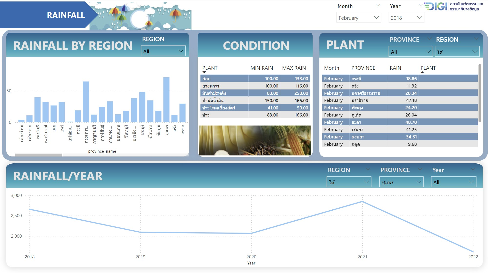

# capstone project rainfall

## folder นี้ประกอบด้วย
1. dags >> ETL_Postgres_to_Bigquery.py
2. docker-compose.yml
3. load.ipynb
4. requirements.txt
7. README.md

## ขั้นตอนการทำงาน

### Neon
project นี้จะนำ raw data ไปเก็บไว้ที่ database postgres ของ [Neon — Serverless, Fault-Tolerant, Branchable Postgres](https://neon.tech/) ซึ่งเป็น serverless ที่สามารถทดลองใช้งานฟรีได้โดยขนาดของข้อมูลไม่เกิน 512 MiB storage, Limited to 0.25 vCPU, 1GB RAM

1. สร้าง new project


2. สร้าง new database


3. copy url ของ Postgres


### Google colab
1. download file load.ipynb ใช้งานผ่าน Google colab ที่เป็นบริการ Software as a Service (Saas) โฮสต์โปรแกรม Jupyter Notebook บน Cloud จาก Google ถ้ามี account gmail ก็สามารถใช้งานได้ฟรี

2. นำ url ที่ copy มาจาก neon ไปแทนที่ตรง connection_string เพื่อ connect กับ database ใน neon


3. run code เพื่อ create table


4. download file rainfall.csv upload ใส่ google colab แล้ว run code ต่อเพื่อ read file ,ทำความสะอาดข้อมูล และนำข้อมูลเข้าไปเก็บใน database posstgres neon 


5. โดยข้อมูลจาก file rainfall.csv ที่นำไปเก็บใน database มีรายละเอียดดังนี้


6. ตรวจสอบว่าข้อมูลอยู่ใน database เรียบร้อย


### Google BigQuery
Google BigQuery เป็น Serverless Data Warehouse หนึ่งในบริการของ Google cloud platform ค่าบริการเป็นแบบ Pay-per-use แต่มีให้ทดลองใช้ฟรี สามารถวิเคราะห์และประมวลผลข้อมูลขนาดใหญ่ (ฺBig data) เพื่อหาผลลัพธ์ตามที่ต้องการได้อย่างมีประสิทธิภาพและรวดเร็ว โดยการใช้ SQL
1. สร้าง new project
2. สร้าง dataset เป็นเหมือนกล่องไว้เก็บ table


3. กด ⋮ ที่ dataset ที่สร้างไว้เลือก create table และระบุชื่อ table “agriculture_cond” และกด CREATE TABLE


4. เลือก agriculture_cond table แล้วกด EDIT SCHEMA และระบุข้อมูลดังนี้


5. กด ⋮ ที่ agriculture_cond เลือก Query จะมีหน้าต่าง Query ขึ้นมา ให้ copy จากไฟล์ agriculture_cond_sql.sql (อย่าลืมปรับแก้ชื่อ dataset) จากนั้นกด RUN จะได้ตารางเงื่อนไขปริมาณน้ำฝนที่เหมาะสมกับพืชเศรษฐกิจ


6. Create service account ที่ IAM & Admin เพื่อสร้าง Key และกำหนด role


7. เมื่อสร้างเสร็จ download file key ในรูปแบบ .json แล้ว upload ใน folder capstone project ใน github 


### Github
1. ปรับแก้ไฟล์ ETL_Postgres_to_Bigquery.py โดยสามารถ find 'change' ได้ว่าจุดไหนที่ต้องปรับแก้
- แก้ dbname, user, password, host เพื่อเชื่อมต่อกับฐานข้อมูล Neon Postgres


-  แก้ keyfile และ project_id


2. เปิด terminal run

```sh
docker-compose up
```
3. เปิด port 8080 จะเข้าไปที่หน้า airflow ซึ่งจะให้ใส่ username password
4. จากไฟล์ docker-compose.yaml จะมีตรง _AIRFLOW_WWW_USER_USERNAME และ _AIRFLOW_WWW_USER_PASSWORD บอก username และ password  สามารถนำไปใช้ login airflow ได้

### Airflow
1. set connection neon และ Bigquery ที่ tab admin >> connection กด + 
- add connection neon

- add connection BigQuery

2. run ETL_Postgres_to_Bigquery ในหน้า UI Airflow

3. ตรวจสอบข้อมูลที่ BigQuery


### Power BI
ในการทำ Visualize ของ project นี้ใช้ Power BI เพราะมี tools ให้เลือกใช้หลากหลาย ยืดหยุ่นและปรับแต่งได้ตามต้องการ มีผู้ใช้งานอย่างกว้างขวางสามารถเรียนรู้ตามได้ง่าย และสามารถ connect ข้อมูลได้จากหลายช่องทาง
1. ดึงข้อมูลจาก BigQuery เข้ามาใน Power BI เพื่อดู Visualize dashboard 


2.