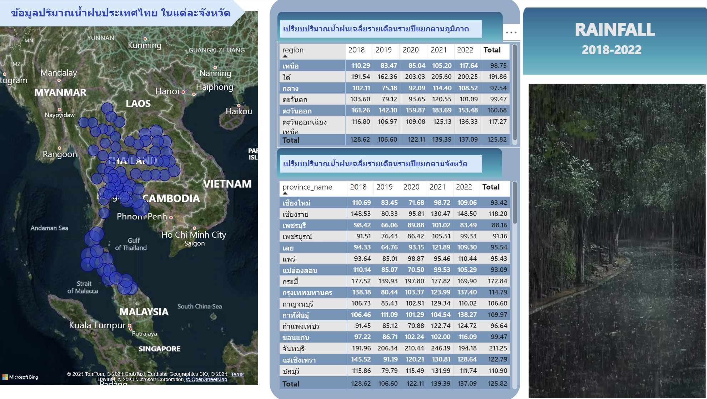

# capstone project rainfall
## การวิเคราะห์ปริมาณน้ำฝนที่เหมาะสมกับการปลูกพืชเศรษฐกิจ

Presentation : https://youtu.be/iG8V7B_A0Rs

### ที่มาและความสำคัญ

จากข้อมูลกรมส่งเสริมการเกษตร กระทรวงเกษตรและสหกรณ์ มีจำนวนครัวเรือนที่ได้ขึ้นทะเบียนเกษตรกร ในปี 2564 มากกว่า 7 ล้านครัวเรือน จาก 20 ล้านครัวเรือน จึงอาจกล่าวได้ว่าประเทศไทยเป็นประเทศเกษตรกรรม ซึ่งก็เป็นประเทศเกษตรกรรมมาตั้งแต่อดีตจนถึงปัจจุบัน เนื่องจากประเทศไทยมีสภาพภูมิอากาศที่เหมาะสมแก่การเพาะปลูก ไม่ว่าจะเป็นในเรื่องของสภาพดิน แร่ธาตุในดิน ความสูงของพื้นที่ เส้นทางน้ำ อุณหภูมิ และอีกปัจจัยที่สำคัญคือปริมาณน้ำฝน เพราะการเพาะปลูกนั้นเรื่องน้ำถือว่าเป็นปัจจัยที่อาจจะกล่าวได้ว่ามีความสำคัญสูงสุด จึงมีความจำเป็นที่จะต้องวิเคราะห์ข้อมูลปริมาณน้ำฝนที่เหมาะสมกับพืชแต่ละชนิด โดยพืชที่จะนำมาใช้วิเคราะห์ได้แก่ ข้าว, ข้าวโพดเลี้ยงสัตว์, ปาล์มน้ำมัน, มันสำปะหลัง, ยางพารา และอ้อย ซึ่งเป็นพืชเศรษฐกิจที่สำคัญของไทย (อ้างอิงจากสำนักงานเศรษฐกิจการเกษตร)

ใน project ข้อมูลปริมาณน้ำฝนของประเทศไทยในแต่ละจังหวัดตั้งแต่ปี พ.ศ. 2561 – 2565 (ปี พ.ศ. 2565 มีข้อมูลถึงเดือนกรกฎาคมเท่านั้น) จาก Data Innovation and Governance Institute, DIGI
https://digi.data.go.th/showcase/thailand-rainfall-data/

### ปัญหา

1. ประเทศไทยมีปัญหาเรื่องพืชล้นตลาดมาตั้งแต่อดีตจนถึงปัจจุบัน เนื่องมาจากราคาพืชในตลาด เมื่อพืชชนิดใดมีราคาที่สูงขึ้นเกษตรกรทั้งประเทศจะปลูกตามกันหมดไม่ว่าจะมีสภาพของพื้นที่เหมาะสมหรือไม่เหมาะสม เหตุเพราะเกษตรกรยังขาดความรู้เรื่องปัจจัยที่ทำให้ได้พืชที่มีคุณภาพ ซึ่งปัญหานี้ทำให้พืชล้นตลาด และราคาพืชลดลง
2. ในการปลูกพืชแต่ละรอบนั้นเกษตรกรต้องวางแผนหลายอย่าง ไม่ว่าจะเป็นในเรื่องของการปรับสภาพพื้นที่ ต้นทุน เมล็ดพันธุ์ หรือวัสดุอุปกรณ์ ซึ่งบางครั้งเกษตรกรปรับเปลี่ยนชนิดพืชกระทันหัน ทำให้ต้องไปกู้เงินมาเพื่อทำการเกษตร ส่งผลให้เมื่อได้กำไรจากการผลิตมาต้องเอาไปใช้หนี้ที่ดอกเบี้ยสูง ไม่เหลือไว้ใช้จุนเจือตัวเองและครอบครัว ต้องไปกู้เงินมาใช้ใหม่อีก เป็นวัฏจักร

### วัตถุประสงค์

1. เพื่อวิเคราะห์ว่ามีจังหวัดใดบ้างที่มีปริมาณน้ำฝนเหมาะสมกับพืชเศรษฐกิจทั้ง 6 ชนิด (แยกชนิดพืช) ให้สามารถนำข้อมูลไปสนับสนุนการทำ  zoning การเพาะปลูกเพื่อป้องกันพืชล้นตลาด
2. เพื่อวิเคราะห์ว่าช่วงเดือนไหนเป็นช่วงที่เหมาะสมกับการเพาะปลูกพืชเศรษฐกิจทั้ง 6 ชนิด (แยกชนิดพืช) ให้สามารถนำข้อมูลไปสนับสนุนการวางแผนการทำการเกษตรกรรมในปีถัดไป

### เกณฑ์ความเหมาะสมของปริมาณน้ำฝนในการปลูกพืชเศรษฐกิจ

- ข้าว ต้องการน้ำประมาณ 100 – 116 มม/เดือน
- ข้าวโพดเลี้ยงสัตว์ ต้องการน้ำประมาณ 41 – 50 มม/เดือน
- ปาล์มน้ำมัน ต้องการน้ำประมาณ 150 – 166 มม/เดือน
- มันสำปะหลัง ต้องการน้ำประมาณ 83 – 250 มม/เดือน
- ยางพารา ต้องการน้ำประมาณ 100 – 116 มม/เดือน
- อ้อย ต้องการน้ำประมาณ 100 – 133 มม/เดือน

### Data modeling

ข้อมูลที่มาใช้วิเคราะห์คือข้อมูล
1. rainfall.csv ที่จะนำมาแตกออกเป็น 2 table คือ
- Rainfall.csv : ข้อมูลปริมาณน้ำฝนต่ำสุด สูงสุด และเฉลี่ย ในแต่ละจังหวัดรายเดือน ตั้งแต่ปี พ.ศ. 2561 – 2565
- Province.csv : ข้อมูลรหัสจังหวัด และชื่อจังหวัดทั้งประเทศไทย มี province_id เป็น primary key
ทั้ง 2 table เชื่อมกันด้วย province_id
2. ตาราง condition เกณฑ์ความเหมาะสมของปริมาณน้ำฝนในการปลูกพืชเศรษฐกิจ


### Workflow Orchestration

project นี้มีการทำงานหลักอยู่ 5 ส่วน คือ neon.hect, Google Colab, Google BigQuery, Airflow และ Power BI 


## folder นี้ประกอบด้วย
1. dags >> ETL_Postgres_to_Bigquery.py : code การทำงานใน airflow
2. docker-compose.yml
3. load.ipynb : code นำข้อมูลจากไฟล์ csv เข้า neoo Postgres
4. requirements.txt
5. agriculture_cond_sql.sql : code SQL insert ข้อมูลเงื่อนไขปริมาณน้ำฝนที่เหมาะสมกับการปลูกพืชเศรษฐกิจเข้าใน Bigquery
6. Rainfall_bi.pbix : Dashboard Power BI
7. rainfall.csv : ข้อมูลปริมาณน้ำฝนจาก https://digi.data.go.th/showcase/thailand-rainfall-data/
7. README.md

## ขั้นตอนการทำงาน

### Neon
project นี้จะนำ raw data ไปเก็บไว้ที่ database postgres ของ [Neon — Serverless, Fault-Tolerant, Branchable Postgres](https://neon.tech/) ซึ่งเป็น serverless ที่สามารถทดลองใช้งานฟรีได้โดยขนาดของข้อมูลไม่เกิน 512 MiB storage, Limited to 0.25 vCPU, 1GB RAM

1. สร้าง new project


2. สร้าง new database


3. copy url ของ Postgres


### Google colab
1. download file load.ipynb ใช้งานผ่าน Google colab ที่เป็นบริการ Software as a Service (Saas) โฮสต์โปรแกรม Jupyter Notebook บน Cloud จาก Google ถ้ามี account gmail ก็สามารถใช้งานได้ฟรี

2. นำ url ที่ copy มาจาก neon ไปแทนที่ตรง connection_string เพื่อ connect กับ database ใน neon


3. run code เพื่อ create table


4. download file rainfall.csv upload ใส่ google colab แล้ว run code ต่อเพื่อ read file ,ทำความสะอาดข้อมูล และนำข้อมูลเข้าไปเก็บใน neon database postgres 


5. โดยข้อมูลจาก file rainfall.csv ที่นำไปเก็บใน database มีรายละเอียดดังนี้


6. ตรวจสอบว่าข้อมูลอยู่ใน database เรียบร้อย


### Google BigQuery
Google BigQuery เป็น Serverless Data Warehouse หนึ่งในบริการของ Google cloud platform ค่าบริการเป็นแบบ Pay-per-use แต่มีให้ทดลองใช้ฟรี สามารถวิเคราะห์และประมวลผลข้อมูลขนาดใหญ่ (ฺBig data) เพื่อหาผลลัพธ์ตามที่ต้องการได้อย่างมีประสิทธิภาพและรวดเร็ว โดยการใช้ SQL
1. สร้าง new project
2. สร้าง dataset เป็นเหมือนกล่องไว้เก็บ table


3. กด ⋮ ที่ dataset ที่สร้างไว้เลือก create table และระบุชื่อ table “agriculture_cond” และกด CREATE TABLE


4. เลือก agriculture_cond table แล้วกด EDIT SCHEMA และระบุข้อมูลดังนี้


5. กด ⋮ ที่ agriculture_cond เลือก Query จะมีหน้าต่าง Query ขึ้นมา ให้ copy จากไฟล์ agriculture_cond_sql.sql (อย่าลืมปรับแก้ชื่อ dataset) จากนั้นกด RUN จะได้ตารางเงื่อนไขปริมาณน้ำฝนที่เหมาะสมกับพืชเศรษฐกิจ


6. Create service account ที่ IAM & Admin เพื่อสร้าง Key และกำหนด role


7. เมื่อสร้างเสร็จ download file key ในรูปแบบ .json แล้ว upload ใน folder capstone project ใน github 


### Github
1. ปรับแก้ไฟล์ ETL_Postgres_to_Bigquery.py โดยสามารถ ctrl+F 'changes' ได้ว่าจุดไหนที่ต้องปรับแก้

- แก้ dbname, user, password, host เพื่อเชื่อมต่อกับฐานข้อมูล Neon Postgres


-  แก้ keyfile และ project_id สามารถ ctrl+F 'keyfile' หรือ 'project_id' ได้


- แก้ dataset_id ให้ตรงกับชื่อ dataset ใน BigQuery ทุกจุดสามารถ ctrl+F 'changes dataset_id' ได้


2. เปิด terminal run

```sh
docker-compose up
```
3. เปิด port 8080 จะเข้าไปที่หน้า airflow ซึ่งจะให้ใส่ username password
4. จากไฟล์ docker-compose.yaml จะมีตรง _AIRFLOW_WWW_USER_USERNAME และ _AIRFLOW_WWW_USER_PASSWORD บอก username และ password  สามารถนำไปใช้ login airflow ได้

### Airflow
1. set connection neon และ Bigquery ที่ tab admin >> connection กด + 
- add connection neon

- add connection BigQuery


ถ้ากด save แล้วขึ้นว่า page can't be found ให้ลบ :8080 ออกแล้ว refresh


2. แก้ postgres_conn_id="neon" ได้มาจากการเพิ่ม connection neon ใน UI Airflow tab Admin >> connection


3. run ETL_Postgres_to_Bigquery ในหน้า UI Airflow


4. จะได้ไฟล์ rainfall.csv กับ province.csv เข้ามาอยู่ใน dags เพื่อที่จะเอาข้อมูลจากตรงนี้ไปเข้าใน BigQuery


3. ตรวจสอบข้อมูลที่ BigQuery จะมี table rainfall และ province เพิ่มขึ้นมา


### Power BI
ในการทำ Visualize ของ project นี้ใช้ Power BI เพราะมี tools ให้เลือกใช้หลากหลาย ยืดหยุ่นและปรับแต่งได้ตามต้องการ มีผู้ใช้งานอย่างกว้างขวางสามารถเรียนรู้ตามได้ง่าย และสามารถ connect ข้อมูลได้จากหลายช่องทาง
1. เปิดไฟล์ Rainfall_bi.pbix บน Power BI Desktop
2. กด Get data เลือก Google BigQuery แล้วใส่ Project Id ที่ต้องการเชื่อมต่อ


3. กด Tranform data เลือกชั้นข้อมูล rainfall แล้วกด navigation เลือกชั้นข้อมูล rainfall ที่อยู่ใน Project Id ที่ได้ทำการเชื่อมต่อไว้


4. กด refresh

