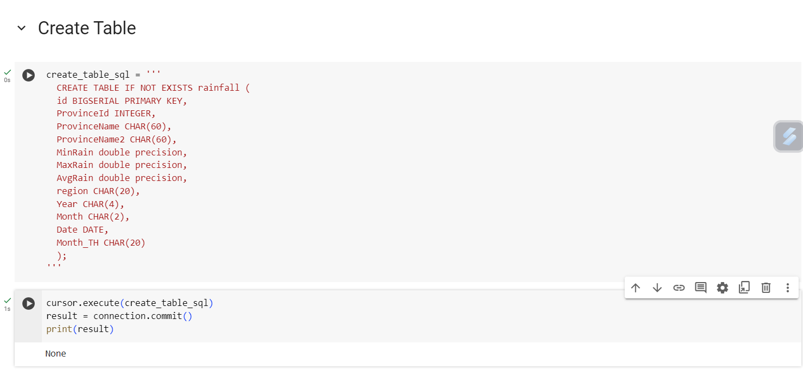
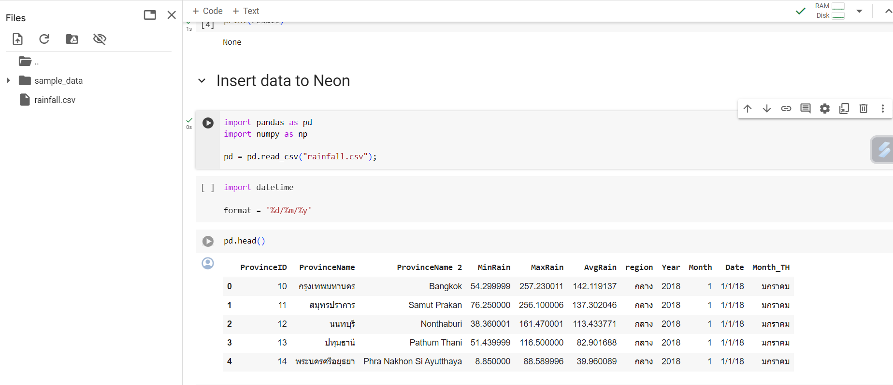
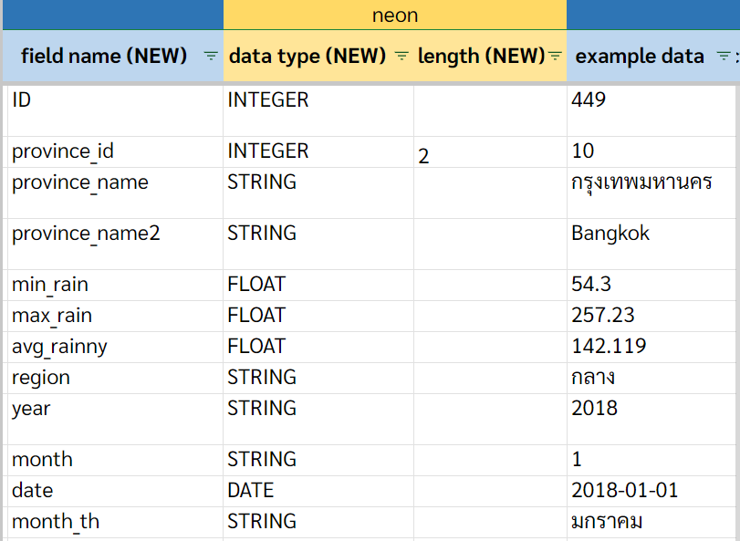

# capstone project rainfall

## folder นี้ประกอบด้วย
foder ds525 ซึ่งมี
1. folder model
- example
    - my_first_dbt_model.sql
    - my_second_dbt_model.sql
    - schema.yml
- marts
    - jaffle_shop_obt.sql
- staging
    - _src.yml
    - stg__jaffle_shop_customers.sql
    - stg__jaffle_shop_orders.sql
- file my_simple_model.sql

2. dbt_project.yml
3. profiles.yml
4. logs
5. scripts
6. docker-compose.yml
7. README.md

## ขั้นตอนการทำงาน

### Neon
1. สร้าง new project


3. สร้าง new database


2. copy url ของ Postgres


### google colab
1. download file load.ipynb สามารถใช้งานผ่าน google colab
2. นำ url ที่ copy มาจาก neon ไปแทนที่ตรง connection_string เพื่อ connect กับ database ใน neon


3. run code เพื่อ create table


4. download file rainfall.csv แล้ว run code ต่อเพื่อ read file ,ทำความสะอาดข้อมูล และนำข้อมูลเข้าไปเก็บใน database posstgres neon 


5. โดยข้อมูลจาก file rainfall.csv ที่นำไปเก็บไว้ใน neon มีดังนี้


1. เปิด terminal run

```sh
docker-compose up
```
2. เปิด port 3000 จะเข้าไปที่หน้า SQLPad ซึ่งจะให้ใส่ username password
3. ดู Username และ Password จากไฟล์ docker-compose.yml ตรง SQLPAD_ADMIN และ SQLPAD_ADMIN_PASSWORD
4. สร้าง ENV

```sh
python -m venv ENV
source ENV/bin/activate
```

5. ติดตั้ง dbt และ postgres

```sh
pip install dbt-core dbt-postgres
```

6. สร้าง dbt_project
```sh
dbt init
```
7. สร้าง profiles ประกอบด้วย ชื่อ project, dbname, host : localhost, pass, port, shchema, threads:1,type , user
8. copy profiles มาใส่ file ชื่อ profiles.yml
9. สามารถทดสอบการเชื่อมต่อกับ dbt ได้โดย cd ไปที่ folder ds525 แล้ว run

```sh
dbt debug
```

10. run model ที่อยู่ใน folder ds525 โดยใช้คำสั่ง
```sh
dbt run
```

11. ดูที่หน้า SQLPad จะมี shchema ชื่อ dbt_jen ถูกสร้างขึ้นแล้วจะมีไฟล์ที่ถูกสร้างขึ้นตามคำสั่งใน model
